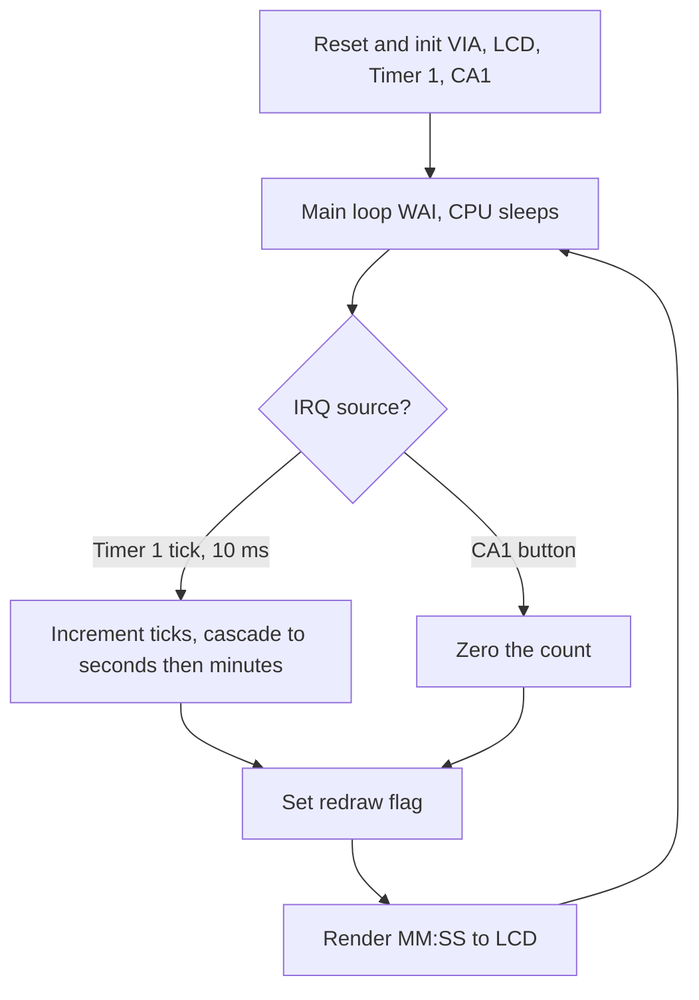

# Interrupt-Driven 6502 Stopwatch


A bare-metal stopwatch for a breadboard 6502 computer, written in hand-assembled 6502 assembly.
It counts **MM:SS** on a 16x2 character LCD and resets to **00:00** on a hardware button press.

I built the whole system by hand on breadboards from individual components (W65C02 CPU, W65C22 VIA,
HD44780 LCD), using Ben Eater's video series as a reference. Nothing came pre-assembled; the wiring
and the firmware are my own. Originally written for a microelectronics course.

This project demonstrates:
- **A cycle-accurate 10 ms timebase** generated by the 6522 VIA's Timer 1 in free-run mode
- **An edge-triggered hardware reset** via the VIA's CA1 interrupt input
- **A single shared IRQ handler** that dispatches between timer ticks and button presses using the interrupt flag register
- **Divide-free digit rendering** (the 6502 has no divide instruction)
- **A power-aware main loop** that halts the CPU with `WAI` and repaints only on change

## Table of Contents
- [Key Features](#key-features)
- [How It Works](#how-it-works)
- [Architecture](#architecture)
- [Repository Structure](#repository-structure)
- [Hardware](#hardware)
- [Build & Flash](#build--flash)
- [Technical Details](#technical-details)
- [Skills Demonstrated](#skills-demonstrated)
- [License](#license)

## Key Features

### ⏱️ Interrupt-Driven Timekeeping
- VIA Timer 1 free-runs and interrupts every **10 ms** (`$270E + 2 = 10,000` cycles at 1 MHz)
- The ISR counts 100 ticks to make 1 second, then cascades seconds into minutes with rollover at 60
- Foreground code never polls the time; it only reacts to a `redraw` flag set by the ISR

### 🔘 Hardware Reset Button
- A push-button wired to the VIA's **CA1** input, configured for falling-edge triggering (`PCR`)
- The same IRQ handler reads the **interrupt flag register (IFR)** to tell a timer tick from a button press
- Reset zeroes ticks/seconds/minutes and forces an immediate repaint

### 🖥️ Hand-Written HD44780 LCD Driver
- 8-bit interface: data on VIA port B, control lines (E/RW/RS) on port A
- Proper **busy-flag polling** (reconfigures port B to input to read the flag) instead of fixed delays
- Separate routines for instruction write, character write, and busy-wait

### 💤 Power-Aware Main Loop
- The main loop issues `WAI` and sleeps until the next interrupt
- The LCD is repainted **only** when the `redraw` flag is set, which avoids constant bus traffic

## How It Works
On reset the firmware configures the VIA ports, initializes the LCD (8-bit / 2-line / 5x8,
display on, auto-increment, clear), arms Timer 1 for a 10 ms free-run tick and CA1 for the
reset button, then drops into a `WAI` loop:

```
Power-on        ->  00:00
(advances once per second)
                    00:01
                    00:02
                    ...
                    01:00
                    ...
[button on CA1] ->  00:00
```

Each Timer 1 interrupt bumps the tick counter; every 100 ticks rolls a second and every 60
seconds a minute. A press on CA1 resets the count. The display is refreshed only when something
actually changed.

## Architecture


## Repository Structure
```
.
├── timer.s        # 6502 assembly source (stopwatch firmware)
├── 📄 README.md   # This documentation
├── 📄 .gitignore  # Ignores build artifacts (*.bin)
└── 📄 LICENSE     # MIT License
```

## Hardware
| Component | Part | Role |
|-----------|------|------|
| CPU | WDC W65C02 @ 1 MHz | 8-bit microprocessor |
| I/O | WDC W65C22 VIA | timer, parallel ports, interrupts |
| Display | HD44780 16x2 character LCD | MM:SS readout |
| Input | momentary push-button on CA1 | reset to 00:00 |

*Built by hand on breadboards from individual components, using Ben Eater's 6502 video series as a reference.*

## Build & Flash
The firmware assembles at `$8000` into a 32K image for an AT28C256 EEPROM, with the reset, IRQ, and NMI vectors at `$FFFA` to `$FFFF`.

```bash
# Assemble to a raw 32K ROM image (-wdc02 enables the W65C02 WAI/STZ instructions)
vasm6502_oldstyle -wdc02 -Fbin -dotdir -o timer.bin timer.s

# Flash to the EEPROM
minipro -p AT28C256 -w timer.bin
```

## Technical Details

### VIA Memory Map
| Address | Register | Use |
|---------|----------|-----|
| `$6000` | PORTB | LCD data bus (D0 to D7) |
| `$6001` | PORTA | LCD control (E/RW/RS) + CA1 button |
| `$6002` | DDRB | port B direction |
| `$6003` | DDRA | port A direction |
| `$6004` | T1C-L | Timer 1 counter low (read clears the IRQ flag) |
| `$6005` | T1C-H | Timer 1 counter high |
| `$600B` | ACR | auxiliary control (Timer 1 free-run) |
| `$600C` | PCR | peripheral control (CA1 falling edge) |
| `$600D` | IFR | interrupt flag register |
| `$600E` | IER | interrupt enable register |

### Timing
| Parameter | Value |
|-----------|-------|
| Clock | 1 MHz |
| Timer 1 reload | `$270E` (+2 cycles) = 10,000 cycles |
| Tick period | 10 ms |
| Ticks per second | 100 |
| Display range | 00:00 to 59:59 |

### Notable Implementation Points
- **Divide-free BCD:** two-digit values are printed by repeated subtraction of 10 (the 6502 has no divide)
- **Minimal ISR:** only the accumulator is saved and restored; the interrupt path never touches X/Y
- **Flag-clearing discipline:** reading T1C-L clears the Timer 1 flag, and reading PORTA clears the CA1 flag

## Skills Demonstrated
| Category | Concepts | Implementation |
|----------|----------|----------------|
| **Bare-metal firmware** | reset/IRQ/NMI vectors, register preservation, ISR design | Single IRQ handler dispatching on the VIA's IFR |
| **Hardware timers** | 6522 VIA Timer 1, free-run mode, cycle-accurate timebase | 10 ms tick at 1 MHz cascaded to MM:SS |
| **Peripheral I/O** | HD44780 LCD protocol, busy-flag polling, edge-triggered input | Hand-written LCD driver and CA1 reset button |
| **6502 assembly** | 6502 ISA, no-divide arithmetic, flag-based control flow | Divide-free 2-digit rendering via repeated subtraction |
| **Low-power design** | event-driven updates, CPU halt | `WAI` sleep with redraw-on-change only |
| **Bring-up & debug** | breadboard wiring, signal-level and program-flow-level debugging | Built and debugged the full system by hand |

## License
This project is licensed under the **MIT License**. See the [LICENSE](LICENSE) file for details.

